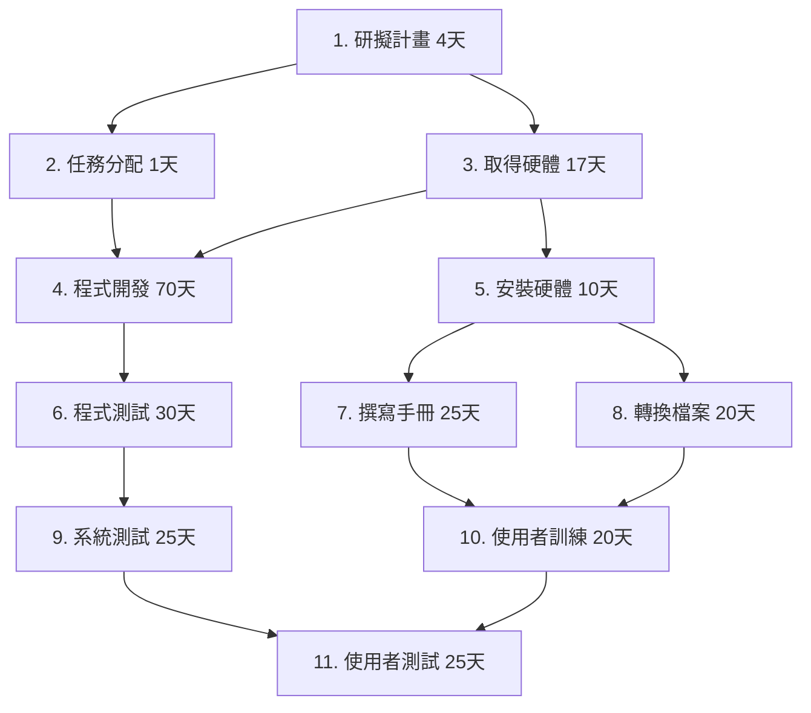
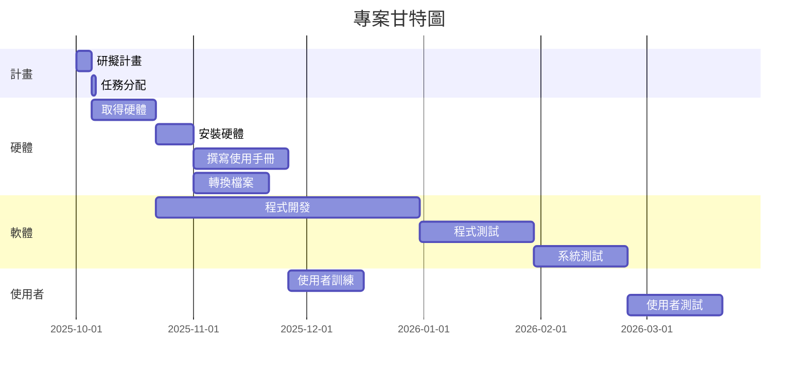

```mermaid
graph TD
  A[1. 研擬計畫 4天] --> B[2. 任務分配 1天]
  A --> C[3. 取得硬體 17天]
  B --> D[4. 程式開發 70天]
  C --> D
  C --> E[5. 安裝硬體 10天]
  D --> F[6. 程式測試 30天]
  E --> G[7. 撰寫手冊 25天]
  E --> H[8. 轉換檔案 20天]
  F --> I[9. 系統測試 25天]
  G --> J[10. 使用者訓練 20天]
  H --> J
  I --> K[11. 使用者測試 25天]
  J --> K

```

```mermaid
gantt
    title 專案甘特圖
    section 計畫
    研擬計畫          :a1, 2025-10-01, 4d
    任務分配          :a2, after a1, 1d
    section 硬體
    取得硬體          :a3, after a1, 17d
    安裝硬體          :a5, after a3, 10d
    撰寫使用手冊      :a7, after a5, 25d
    轉換檔案          :a8, after a5, 20d
    section 軟體
    程式開發          :a4, after a2 a3, 70d
    程式測試          :a6, after a4, 30d
    系統測試          :a9, after a6, 25d
    section 使用者
    使用者訓練        :a10, after a7 a8, 20d
    使用者測試        :a11, after a9 a10, 25d
```
